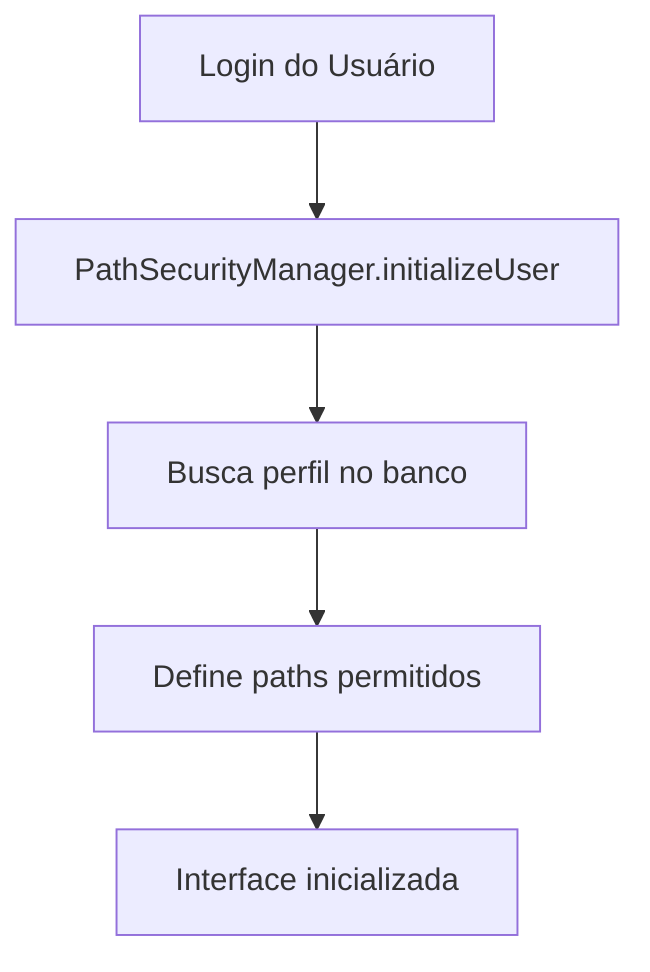
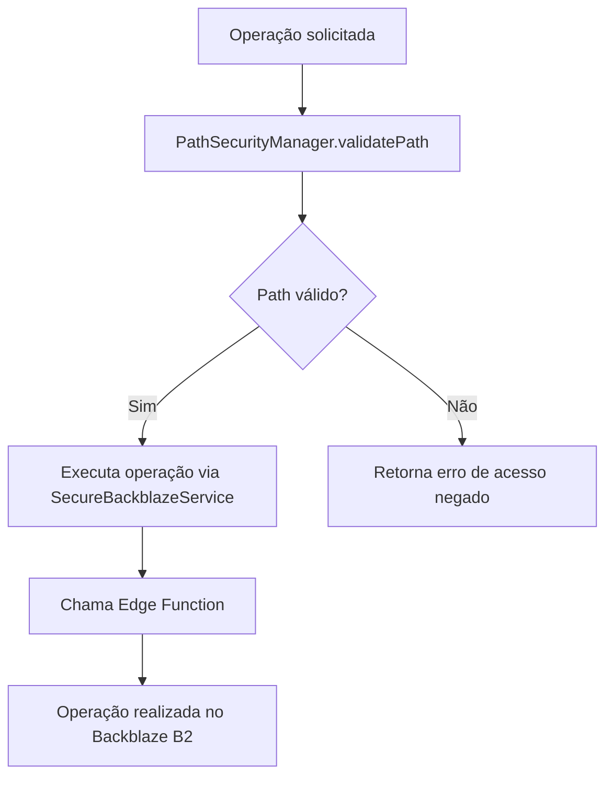

# Sistema de Controle de Acesso por Empresa

## Visão Geral

Implementamos um sistema completo de controle de acesso que garante o isolamento de dados entre empresas e controla o acesso baseado no role dos usuários. Este sistema é fundamental para o funcionamento seguro do CloudFlow Vault como uma plataforma SaaS multitenancy.

## Arquitetura do Sistema

### 1. **Estrutura de Pastas no Backblaze B2**

```
cloud-vault/
├── company-{company-id-1}/
│   ├── users/
│   │   ├── user-{user-id-1}/     # Arquivos pessoais do usuário
│   │   └── user-{user-id-2}/
│   ├── shared/                   # Arquivos compartilhados da empresa
│   │   ├── documents/
│   │   ├── projects/
│   │   └── templates/
│   └── admin/                    # Área administrativa (só admins)
└── company-{company-id-2}/
    └── ... (mesma estrutura)
```

### 2. **Níveis de Acesso por Role**

#### **Super Admin**
- ✅ Acesso completo a todas as empresas
- ✅ Pode navegar livremente por qualquer path
- ✅ Gerencia o sistema globalmente

#### **Company Admin**
- ✅ Acesso total à empresa própria (`company-{id}/`)
- ✅ Pode acessar todos os usuários da empresa
- ✅ Acesso à área administrativa da empresa
- ❌ Não pode acessar outras empresas

#### **User (Usuário Comum)**
- ✅ Acesso à pasta pessoal (`company-{id}/users/user-{id}/`)
- ✅ Acesso aos arquivos compartilhados (`company-{id}/shared/`)
- ❌ Não pode acessar área administrativa
- ❌ Não pode acessar pastas de outros usuários
- ❌ Não pode acessar outras empresas

## Componentes Implementados

### 1. **PathSecurityManager** (`/src/utils/pathSecurity.ts`)

**Classe singleton que gerencia toda a segurança de paths:**

```typescript
// Principais métodos:
- initializeUser(user): Inicializa o perfil do usuário
- validatePath(path): Valida se usuário pode acessar um path
- getDefaultPath(): Retorna path padrão baseado no role
- getCompanyBasePath(): Path base da empresa
- getUserPersonalPath(): Path pessoal do usuário
- getCompanySharedPath(): Path compartilhado da empresa
- getCompanyAdminPath(): Path administrativo
```

### 2. **SecureBackblazeService** (`/src/services/secureBackblaze.ts`)

**Serviço que aplica validações de segurança em todas as operações:**

```typescript
// Todas as operações passam por validação:
- listFiles(path): Lista arquivos com validação
- uploadFile(path, file): Upload com validação de path
- deleteFile(key): Exclusão com validação
- downloadFile(key): Download com validação
- createFolder(path, name): Criação de pasta com validação
- navigateToFolder(currentPath, folderName): Navegação segura
```

### 3. **SecureFileManager** (`/src/components/SecureFileManager.tsx`)

**Componente React que fornece interface completa:**

- 📁 Navegação hierárquica de pastas
- 🏠 Botões de acesso rápido baseados no role
- 📤 Upload de múltiplos arquivos
- 📂 Criação de pastas
- 📥 Download direto de arquivos
- 🗑️ Exclusão de arquivos e pastas
- 🔒 Validação em tempo real de permissões

### 4. **Edge Function Atualizada** (`/supabase/functions/b2-proxy/index.ts`)

**Novas ações adicionadas:**

```typescript
// Ações para automação:
- createCompanyStructure: Cria estrutura completa para nova empresa
- createUserPersonalFolder: Cria pasta pessoal para novo usuário
```

### 5. **Funções SQL de Segurança** (`/security_and_folders.sql`)

**Funções do banco de dados:**

```sql
-- Validação de acesso via SQL:
- validate_user_path_access(user_id, path): Valida acesso via banco
- get_user_available_paths(user_id): Retorna paths disponíveis
- create_company_folder_structure(company_id): Cria estrutura automaticamente

-- Triggers automáticos:
- Criação de estrutura ao inserir nova empresa
- Criação de pasta pessoal ao adicionar usuário
```

## Fluxo de Segurança

### 1. **Inicialização do Usuário**


### 2. **Validação de Operações**


## Automações Implementadas

### 1. **Nova Empresa**
Ao criar uma empresa, automaticamente:
- ✅ Cria estrutura de pastas no Backblaze B2
- ✅ Registra logs da operação
- ✅ Configura permissões básicas

### 2. **Novo Usuário**
Ao adicionar um usuário:
- ✅ Cria pasta pessoal automaticamente
- ✅ Configura permissões baseadas no role
- ✅ Registra atividade nos logs

## Recursos de Segurança

### 1. **Validação Dupla**
- ✅ Frontend valida antes de enviar requisições
- ✅ Edge Function valida novamente antes de executar
- ✅ Banco de dados fornece funções de validação

### 2. **Logs de Auditoria**
- ✅ Todas as operações são registradas
- ✅ Incluí detalhes de usuário, empresa e operação
- ✅ Logs são filtrados por empresa (RLS)

### 3. **Paths Normalizados**
- ✅ Remoção de barras duplas
- ✅ Validação de caracteres especiais
- ✅ Prevenção de path traversal

### 4. **Isolamento de Dados**
- ✅ Usuários só veem dados da própria empresa
- ✅ Validação em tempo real de permissões
- ✅ Estrutura hierárquica clara

## Como Usar

### 1. **Para Desenvolvedores**

```typescript
import { PathSecurityManager } from '@/utils/pathSecurity'
import { secureBackblazeService } from '@/services/secureBackblaze'

// Inicializar sistema (automático no componente)
const securityManager = PathSecurityManager.getInstance()
await securityManager.initializeUser(user)

// Usar serviço seguro
const files = await secureBackblazeService.listFiles('/shared/documents/')
```

### 2. **Para Usuários Finais**
- 🌐 Acesse `/secure-files` na aplicação
- 🔑 O sistema automaticamente aplica suas permissões
- 📁 Use os botões de "Acesso Rápido" para navegação
- 🔒 Tentativas de acesso não autorizado serão bloqueadas

### 3. **Para Administradores**

**Super Admin:**
- ✅ Pode acessar qualquer empresa via interface
- ✅ Monitora logs de segurança
- ✅ Gerencia estruturas de empresas

**Company Admin:**
- ✅ Acesso total à própria empresa
- ✅ Pode gerenciar usuários da empresa
- ✅ Acessa área administrativa

## Benefícios do Sistema

### 1. **Segurança**
- 🛡️ Isolamento completo entre empresas
- 🔐 Controle granular de permissões
- 📋 Logs detalhados de auditoria
- 🚫 Prevenção de acessos não autorizados

### 2. **Usabilidade**
- 🎯 Interface intuitiva baseada em roles
- 🏠 Navegação rápida com botões contextuais
- 📱 Responsivo e acessível
- ⚡ Performance otimizada

### 3. **Escalabilidade**
- 🏢 Suporte a múltiplas empresas
- 👥 Usuários ilimitados por empresa
- 📈 Estrutura preparada para crescimento
- 🔄 Automações reduzem trabalho manual

### 4. **Conformidade**
- ✅ LGPD/GDPR compliance
- 📊 Auditoria completa
- 🏛️ Segregação de dados
- 📋 Relatórios de acesso

## Próximos Passos

1. **Testes de Segurança**
   - Penetration testing
   - Validação de isolamento
   - Testes de performance

2. **Monitoramento**
   - Dashboard de alertas
   - Métricas de segurança
   - Relatórios automáticos

3. **Melhorias de UX**
   - Busca avançada
   - Favoritos e bookmarks
   - Visualizações customizadas

---

Este sistema garante que cada empresa tenha total isolamento de seus dados, enquanto oferece controle granular baseado nos roles dos usuários, criando uma experiência segura e profissional para o CloudFlow Vault.
